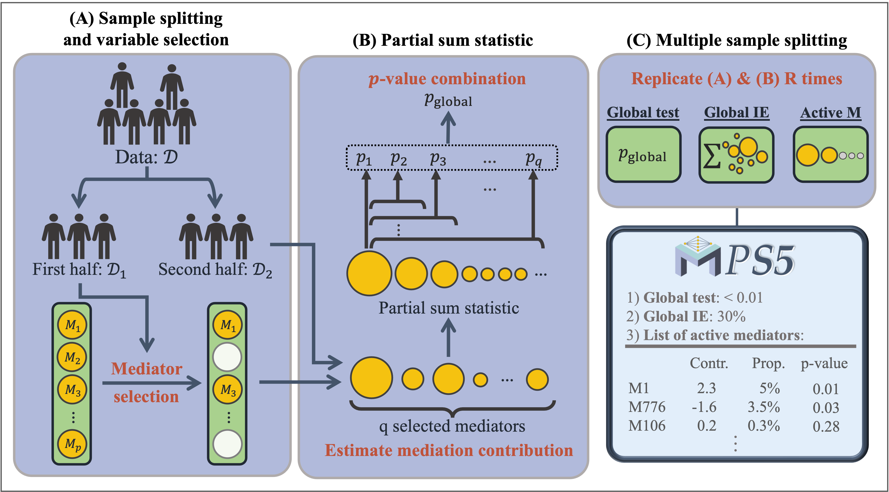

## PS5Med: Partial Sum Statistic and Sample Splitting Strategy for MEDiation analysis 


PS5Med is an R package for high-dimensional mediation analysis, including two methods (`PS5` & `PS5.multisplit`). While `PS5` performs the fast operation by single sample split, `PS5.multisplit` provides more robust mediation analysis by multi sample split. The figure below shows the framework of our method. 



## Installation

The package can be downloaded and installed from GitHub.

```
install.packages('devtools')
devtools::install_github('hung-ching-chang/PS%Med')
```
If the package cannot be installed successfully, it is needed to ensure that the dependency packages are installed. This package is based on R (>= 4.0.5), and the R code for installing the dependent packages is:
```
## from CRAN
CRAN.packages <- function(pkg){
    new.pkg <- pkg[!(pkg %in% installed.packages()[, "Package"])]
    if (length(new.pkg)) 
        install.packages(new.pkg, dependencies = TRUE)
}
CRAN.packages(c("ncvreg", "Matrix", "mvtnorm", "parallel"))
```


## Code for the manuscript
The code for the simulation section in the PS5 manuscript can be found in the folder `inst/simulation`.


## Contact package maintainer:
Hung-Ching Chang
Email: rick.chang@pitt.edu

## Citation:
Chang, H.C., Fang, Y., Gorczyca, M., Batmanghelich, K., Tseng, G.C. (2024+). High-Dimensional Causal Mediation Analysis by Partial Sum Statistic and Sample Splitting Strategy in Imaging Genetics Application.


